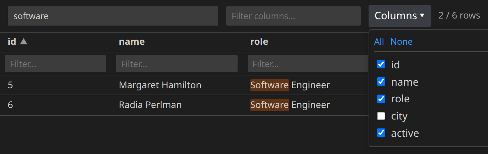

# JSON Table Viewer

View any JSON file as an interactive table, right inside VS Code — no need to eyeball raw brackets and indentation to find the row you're after.

By ZPK.



## Features

- **View as Table** — right-click any `.json` file (or run the command from the Command Palette) to open it as a table alongside your editor.
- **Search with highlighting** — a global search box filters rows to matches and highlights the matching text as you type.
- **Per-column filters** — narrow rows down by typing into the filter box under any column header.
- **Sortable columns** — click a column header to sort ascending or descending; numeric columns sort numerically, not alphabetically.
- **Column picker** — show only the columns you care about via the "Columns" dropdown (check/uncheck individually, or "All"/"None"), or type into "Filter columns..." to narrow the column list itself.
- **Handles nested JSON** — arrays of objects, nested objects (flattened into `parent.child` columns), arrays of primitives, and objects-of-objects all render sensibly as a table.
- **Runs entirely locally** — everything happens in the webview; no data ever leaves your machine.

## Installation

This extension isn't published on the VS Code Marketplace, so it's installed from source as a `.vsix` package:

```bash
git clone https://github.com/zpk3n0/json-table-viewer.git
cd json-table-viewer
npm install
npx @vscode/vsce package
code --install-extension json-table-viewer-*.vsix
```

Requires [Node.js](https://nodejs.org/) (with npm) to build. After installing, run **"Developer: Reload Window"** in VS Code (or restart it) to activate the extension.

To get updates later, `git pull` and repeat the steps above — VS Code will prompt to overwrite the previous version.

## Usage

1. Right-click a `.json` file in the Explorer (or open one and use the Command Palette) and choose **View as Table**.
2. Use the search box to find rows, the per-column filters to narrow specific fields, and the **Columns** dropdown to hide fields you don't need.
